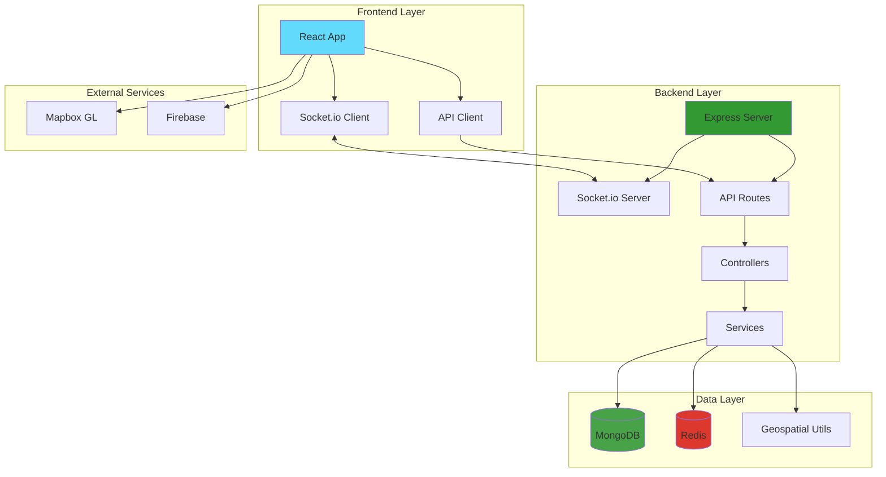
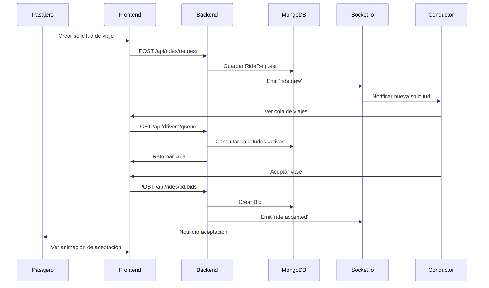
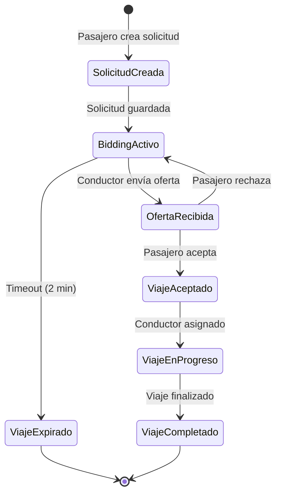
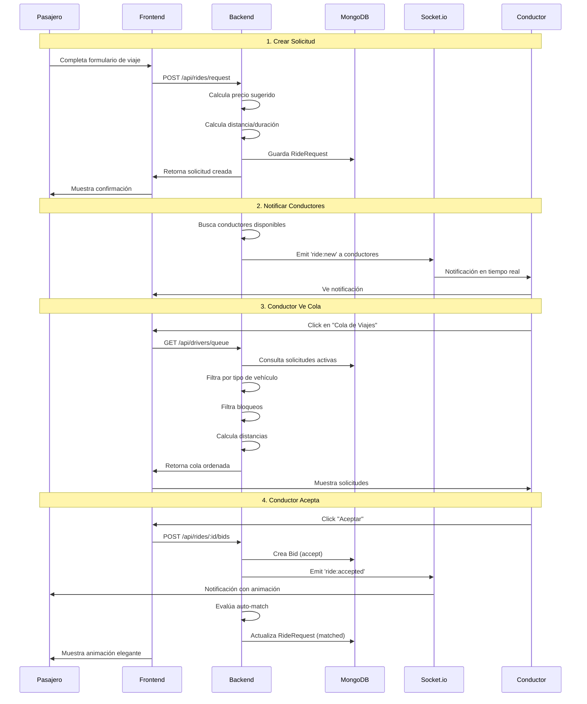
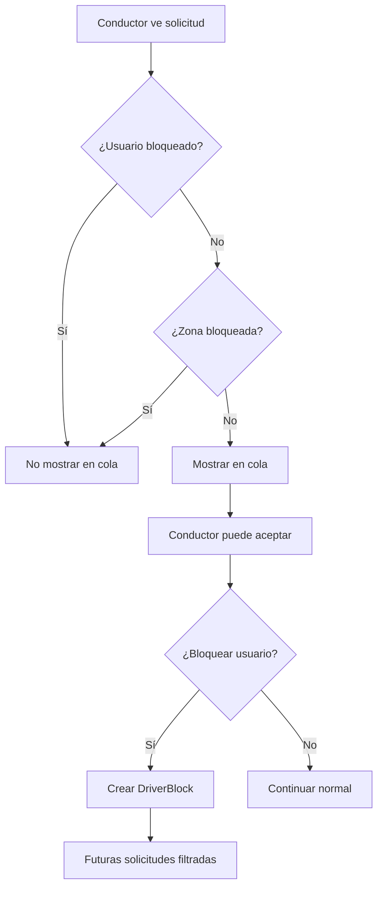
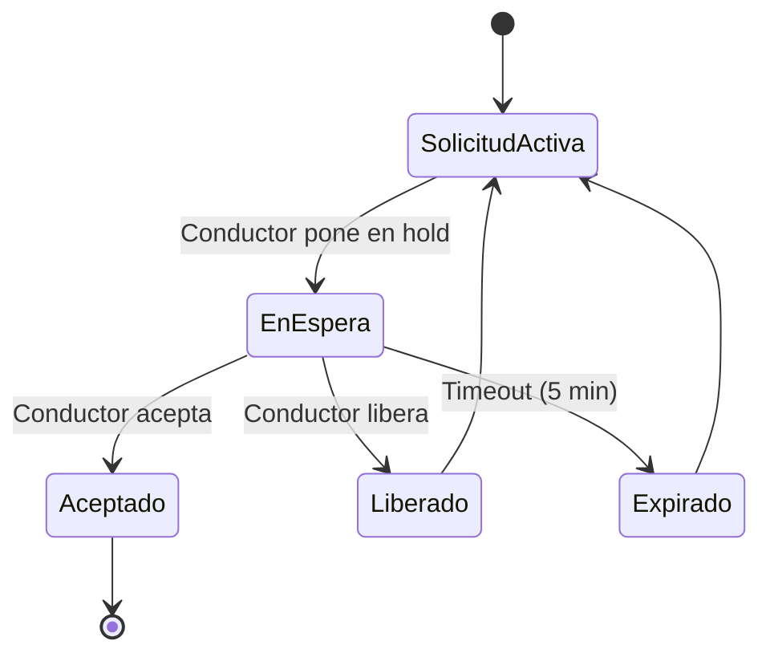

# 🚗 DiDi-Sicuani

<div align="center">


**Plataforma de Movilidad Urbana con Sistema de Reverse Bidding**

*Conectando pasajeros y conductores en Sicuani, Perú*

[Características](#-características-principales) • [Instalación](#-instalación) • [Documentación](#-documentación) • [Manual de Usuario](#-manual-de-usuario)

</div>

---

## 📋 Tabla de Contenidos

- [Descripción del Proyecto](#-descripción-del-proyecto)
- [Características Principales](#-características-principales)
- [Arquitectura del Sistema](#-arquitectura-del-sistema)
- [Stack Tecnológico](#-stack-tecnológico)
- [Estructura del Proyecto](#-estructura-del-proyecto)
- [Instalación](#-instalación)
- [Configuración](#-configuración)
- [Manual de Usuario](#-manual-de-usuario)
- [API Documentation](#-api-documentation)
- [Flujos de Trabajo](#-flujos-de-trabajo)
- [Estado del Proyecto](#-estado-del-proyecto)

---

## 🎯 Descripción del Proyecto

**DiDi-Sicuani** es una plataforma completa de ride-hailing desarrollada específicamente para Sicuani, Perú. La plataforma implementa un innovador **sistema de Reverse Bidding** donde los pasajeros proponen el precio que están dispuestos a pagar, y los conductores pueden aceptar, rechazar o hacer contraofertas.

### Objetivos del Proyecto

- ✅ Proporcionar una alternativa accesible y económica a servicios como Uber y DiDi
- ✅ Empoderar a los pasajeros con control sobre los precios
- ✅ Ofrecer a los conductores herramientas avanzadas de gestión y optimización
- ✅ Funcionar sin dependencia de APIs costosas (Google Maps, etc.)
- ✅ Implementar geolocalización offline usando tecnologías open-source

### Características Únicas

1. **Sistema de Reverse Bidding**: Los pasajeros proponen precios, los conductores deciden
2. **Notificaciones en Tiempo Real**: Comunicación instantánea vía Socket.io
3. **Animaciones Elegantes**: Experiencia de usuario mejorada con animaciones fluidas
4. **Sistema de Bloqueo Inteligente**: Conductores pueden bloquear usuarios o zonas
5. **Sistema de Espera (Hold)**: Conductores pueden reservar viajes temporalmente
6. **Geolocalización Offline**: Cálculos geográficos sin dependencia de APIs externas

---

## ✨ Características Principales

### Para Pasajeros 👤

- 🎫 **Solicitar Viajes**: Crear solicitudes con precio propuesto
- 💰 **Sistema de Bidding**: Ver ofertas de múltiples conductores
- ✅ **Aceptar/Rechazar Ofertas**: Control total sobre las ofertas recibidas
- 🎉 **Notificaciones Animadas**: Animaciones elegantes cuando un conductor acepta
- 📍 **Geolocalización**: Cálculo preciso de distancias y tiempos
- 📱 **Interfaz Intuitiva**: Diseño moderno y fácil de usar

### Para Conductores 🚗

- 📋 **Cola de Viajes**: Ver todas las solicitudes disponibles en tiempo real
- ✅ **Aceptar/Rechazar**: Decisión rápida sobre solicitudes
- ⏸️ **Poner en Espera**: Reservar viajes por 5 minutos
- 🚫 **Sistema de Bloqueo**: Bloquear usuarios o zonas específicas
- 📊 **Información Detallada**: Ver distancia, ETA, precio, y más
- 🎯 **Filtrado Inteligente**: Solo ver solicitudes relevantes según tipo de vehículo

### Para Administradores 👨‍💼

- 📊 **Dashboard en Tiempo Real**: Métricas actualizadas automáticamente
- 📈 **Gráficos Interactivos**: Visualización de datos con Recharts
- 👥 **Gestión de Usuarios**: Administrar pasajeros y conductores
- 🚦 **Gestión de Viajes**: Monitorear y gestionar solicitudes activas
- 📉 **Analytics**: Reportes y análisis de uso

---

## 🏗️ Arquitectura del Sistema

### Diagrama de Arquitectura General



### Flujo de Datos



### Flujo de Reverse Bidding



---

## 🛠️ Stack Tecnológico

### Backend

| Tecnología | Versión | Propósito |
|------------|---------|-----------|
| **Node.js** | 18+ | Runtime de JavaScript |
| **Express.js** | 4.21+ | Framework web |
| **MongoDB** | 6+ | Base de datos principal |
| **Mongoose** | 8+ | ODM para MongoDB |
| **Redis** | 7+ | Cache y colas |
| **Socket.io** | 4.8+ | Comunicación en tiempo real |
| **JWT** | 9+ | Autenticación |
| **Swagger** | - | Documentación API |
| **Nodemon** | 3+ | Desarrollo con hot-reload |

### Frontend

| Tecnología | Versión | Propósito |
|------------|---------|-----------|
| **React** | 18.3+ | Framework UI |
| **Vite** | 7.2+ | Build tool |
| **Tailwind CSS** | 4.1+ | Framework de estilos |
| **Material UI** | 7+ | Componentes UI |
| **Framer Motion** | 12+ | Animaciones |
| **Recharts** | 3+ | Gráficos |
| **Zustand** | 5+ | Estado global |
| **Socket.io Client** | 4.8+ | WebSockets |
| **React Router** | 7+ | Routing |
| **Axios** | 1+ | Cliente HTTP |

### Mobile

| Tecnología | Versión | Propósito |
|------------|---------|-----------|
| **React Native** | 0.72+ | Framework móvil |
| **Mapbox GL** | 10+ | Mapas offline |
| **@react-navigation** | 6+ | Navegación |
| **Firebase** | 10+ | Notificaciones push |

### Herramientas de Desarrollo

- **ESLint**: Linting de código
- **Prettier**: Formateo de código
- **Git**: Control de versiones
- **Postman/Thunder Client**: Testing de API

---

## 📁 Estructura del Proyecto

```
didi-sicuani/
│
├── 📂 backend/                          # API Backend (Express)
│   ├── 📂 config/                       # Configuraciones
│   │   ├── database.js                 # Conexión MongoDB
│   │   ├── redis.js                    # Conexión Redis
│   │   └── swagger.js                  # Configuración Swagger
│   │
│   ├── 📂 controllers/                  # Controladores (lógica de negocio)
│   │   ├── auth.controller.js          # Autenticación
│   │   ├── bidding.controller.js       # Sistema de bidding
│   │   └── driver.controller.js        # Gestión de conductores
│   │
│   ├── 📂 middleware/                   # Middlewares
│   │   └── auth.middleware.js          # Autenticación JWT
│   │
│   ├── 📂 models/                       # Modelos MongoDB
│   │   ├── User.js                     # Usuario (pasajero/conductor)
│   │   ├── RideRequest.js              # Solicitud de viaje
│   │   ├── Bid.js                      # Oferta de conductor
│   │   ├── BidNegotiation.js           # Negociación de precios
│   │   ├── DriverBlock.js              # Bloqueos de conductores
│   │   └── DriverHold.js                # Viajes en espera
│   │
│   ├── 📂 routes/                       # Rutas API
│   │   ├── auth.routes.js              # Rutas de autenticación
│   │   ├── rides.routes.js             # Rutas de viajes
│   │   ├── bidding.routes.js           # Rutas de bidding
│   │   ├── driver.routes.js            # Rutas de conductores
│   │   └── admin.routes.js             # Rutas de administración
│   │
│   ├── 📂 services/                     # Servicios de negocio
│   │   ├── bidding.service.js          # Lógica de reverse bidding
│   │   ├── pricing.service.js          # Cálculo de precios
│   │   ├── metrics.service.js          # Métricas en tiempo real
│   │   ├── driver-blocking.service.js  # Sistema de bloqueo
│   │   └── driver-hold.service.js      # Sistema de espera
│   │
│   ├── 📂 utils/                        # Utilidades
│   │   ├── socket.js                   # Configuración Socket.io
│   │   ├── geospatial.js               # Cálculos geográficos
│   │   └── cron.js                     # Tareas programadas
│   │
│   ├── 📂 scripts/                     # Scripts de utilidad
│   │   ├── create-test-users.js        # Crear usuarios de prueba
│   │   └── test-socket-clients.js      # Probar Socket.io
│   │
│   ├── server.js                       # Entry point
│   ├── package.json                    # Dependencias
│   ├── nodemon.json                    # Configuración Nodemon
│   └── .env.example                    # Variables de entorno ejemplo
│
├── 📂 frontend/                         # Aplicación React
│   ├── 📂 src/
│   │   ├── 📂 components/              # Componentes reutilizables
│   │   │   ├── Layout.jsx             # Layout principal
│   │   │   └── RideAcceptedAnimation.jsx  # Animación de aceptación
│   │   │
│   │   ├── 📂 pages/                   # Páginas
│   │   │   ├── Login.jsx              # Inicio de sesión
│   │   │   ├── Register.jsx           # Registro
│   │   │   ├── Dashboard.jsx          # Dashboard principal
│   │   │   ├── PassengerDashboard.jsx # Dashboard pasajero
│   │   │   ├── DriverDashboard.jsx    # Dashboard conductor
│   │   │   ├── AdminDashboard.jsx     # Dashboard admin
│   │   │   ├── RideRequest.jsx        # Solicitar viaje
│   │   │   ├── RideQueue.jsx          # Cola de viajes (conductor)
│   │   │   ├── BiddingPage.jsx        # Página de ofertas
│   │   │   └── Metrics.jsx            # Métricas en tiempo real
│   │   │
│   │   ├── 📂 services/               # Servicios
│   │   │   ├── api.js                 # Cliente API
│   │   │   └── socket.js              # Cliente Socket.io
│   │   │
│   │   ├── 📂 store/                  # Estado global (Zustand)
│   │   │   └── authStore.js           # Store de autenticación
│   │   │
│   │   ├── App.jsx                    # Componente raíz
│   │   ├── main.jsx                   # Entry point
│   │   └── index.css                  # Estilos globales
│   │
│   ├── index.html                     # HTML principal
│   ├── vite.config.js                 # Configuración Vite
│   └── package.json                   # Dependencias
│
├── 📂 mobile/                          # Aplicación React Native
│   ├── 📂 src/
│   │   ├── 📂 screens/                # Pantallas
│   │   ├── 📂 services/               # Servicios
│   │   └── 📂 config/                  # Configuraciones
│   └── package.json
│
├── 📂 scripts/                         # Scripts del proyecto
│   └── update-osm-data.sh            # Actualizar datos OSM
│
├── 📄 README.md                        # Este archivo
├── 📄 INSTALLATION.md                  # Guía de instalación
├── 📄 PROJECT_STRUCTURE.md             # Estructura detallada
└── 📄 .gitignore                       # Archivos ignorados por Git
```

---

## 🚀 Instalación

### Requisitos Previos

- **Node.js** 18.0.0 o superior
- **MongoDB** 6.0 o superior
- **Redis** 7.0 o superior
- **npm** o **yarn**

### Instalación Paso a Paso

#### 1. Clonar el Repositorio

```bash
git clone https://github.com/tu-usuario/didi-sicuani.git
cd didi-sicuani
```

#### 2. Configurar Backend

```bash
cd backend
npm install
cp .env.example .env
```

Editar `.env` con tus credenciales:

```env
# MongoDB
MONGODB_URI=mongodb://localhost:27017/didi-sicuani

# Redis
REDIS_HOST=localhost
REDIS_PORT=6379

# JWT
JWT_SECRET=tu-secret-key-super-segura

# Server
PORT=5000
NODE_ENV=development

# Socket.io
SOCKET_URL=http://localhost:5000
```

#### 3. Configurar Frontend

```bash
cd ../frontend
npm install
cp .env.example .env
```

Editar `.env`:

```env
VITE_API_URL=http://localhost:5000/api
VITE_SOCKET_URL=http://localhost:5000
```

#### 4. Iniciar Servicios

**Terminal 1 - MongoDB:**
```bash
# Windows (si está como servicio)
# MongoDB debería iniciar automáticamente

# Linux/Mac
mongod
```

**Terminal 2 - Redis:**
```bash
# Windows
redis-server

# Linux/Mac
redis-server
```

**Terminal 3 - Backend:**
```bash
cd backend
npm run dev
```

**Terminal 4 - Frontend:**
```bash
cd frontend
npm run dev
```

#### 5. Acceder a la Aplicación

- **Frontend**: http://localhost:5173
- **Backend API**: http://localhost:5000
- **API Documentation (Swagger)**: http://localhost:5000/api-docs

---

## ⚙️ Configuración

### Crear Usuarios de Prueba

Para probar con múltiples usuarios (pasajero y conductor):

```bash
cd backend
node scripts/create-test-users.js
```

Esto creará:
- 1 usuario pasajero
- 1 conductor de taxi
- 1 conductor de mototaxi

### Verificar Conexiones

```bash
# MongoDB
node backend/test-mongodb.js

# Redis
node backend/test-redis.js

# Todas las conexiones
node backend/test-all-connections.js
```

---

## 📖 Manual de Usuario

### Para Pasajeros 👤

#### 1. Registro e Inicio de Sesión

**Paso 1:** Acceder a la aplicación
- Abre http://localhost:5173 en tu navegador
- Verás la página de inicio de sesión

**Paso 2:** Crear cuenta
- Click en "Registrarse"
- Completa el formulario:
  - Nombre completo
  - Email
  - Teléfono (opcional)
  - Contraseña
  - Tipo de usuario: **Pasajero**
- Click en "Registrarse"

**Paso 3:** Iniciar sesión
- Ingresa tu email y contraseña
- Click en "Iniciar Sesión"
- Serás redirigido al Dashboard de Pasajero

#### 2. Solicitar un Viaje

**Paso 1:** Ir a "Solicitar Viaje"
- Desde el dashboard, click en "Solicitar Viaje" en el menú

**Paso 2:** Completar formulario
- **Origen**: Ingresa la dirección de origen
- **Destino**: Ingresa la dirección de destino
- **Tipo de Vehículo**: Selecciona:
  - `Cualquiera` - Verás ofertas de todos los conductores
  - `Taxi` - Solo conductores de taxi
  - `Mototaxi` - Solo conductores de mototaxi
- **Precio Ofrecido**: Ingresa el precio que estás dispuesto a pagar (en Soles)

**Paso 3:** Calcular precio sugerido (opcional)
- Click en "Calcular Precio Sugerido"
- El sistema calculará un precio basado en distancia y demanda

**Paso 4:** Enviar solicitud
- Click en "Solicitar Viaje"
- Verás un mensaje de confirmación
- Serás redirigido a la página de ofertas

#### 3. Ver y Gestionar Ofertas

**Paso 1:** Ver ofertas recibidas
- En la página de ofertas verás todas las ofertas de conductores
- Cada oferta muestra:
  - Nombre del conductor
  - Rating del conductor
  - Tipo de oferta:
    - ✅ **Acepta tu precio**: El conductor acepta tu precio propuesto
    - 💰 **Contraoferta**: El conductor propone un precio diferente
  - Distancia y tiempo estimado (ETA)
  - Precio ofrecido

**Paso 2:** Aceptar una oferta
- Click en "Aceptar" en la oferta que prefieras
- El viaje será confirmado
- Verás una animación de celebración con información del conductor

**Paso 3:** Notificación de aceptación
- Cuando un conductor acepta tu solicitud directamente, recibirás:
  - Una notificación toast
  - Una animación elegante con:
    - ✅ Icono de éxito animado
    - Información completa del conductor
    - Distancia y ETA
    - Precio acordado
    - Confetti animado

#### 4. Ver Historial de Viajes

- Desde el dashboard, puedes ver tu historial de viajes
- Cada viaje muestra:
  - Fecha y hora
  - Origen y destino
  - Conductor asignado
  - Precio final
  - Estado del viaje

---

### Para Conductores 🚗

#### 1. Registro e Inicio de Sesión

**Paso 1:** Crear cuenta de conductor
- Click en "Registrarse"
- Completa el formulario:
  - Nombre completo
  - Email
  - Teléfono
  - Contraseña
  - Tipo de usuario: **Conductor**
  - Información adicional:
    - Tipo de vehículo (Taxi o Mototaxi)
    - Placa del vehículo
    - Modelo del vehículo (opcional)
    - Color del vehículo (opcional)

**Paso 2:** Iniciar sesión
- Ingresa tu email y contraseña
- Click en "Iniciar Sesión"
- Serás redirigido al Dashboard de Conductor

#### 2. Ver Cola de Viajes

**Paso 1:** Acceder a la cola
- Desde el dashboard, click en "Cola de Viajes" en el menú
- Verás todas las solicitudes activas que coinciden con tu tipo de vehículo

**Paso 2:** Información mostrada
- Cada solicitud muestra:
  - **Pasajero**: Nombre y teléfono
  - **Ruta**: Origen → Destino
  - **Precio Ofrecido**: Precio que el pasajero está dispuesto a pagar
  - **Precio Sugerido**: Precio calculado por el sistema
  - **Distancia del Viaje**: Distancia total del viaje
  - **Distancia desde ti**: Tu distancia al punto de recogida
  - **ETA**: Tiempo estimado para llegar al pasajero
  - **Tipo de Vehículo**: Taxi, Mototaxi, o Cualquiera
  - **Método de Pago**: Efectivo, tarjeta, etc.
  - **Tiempo de Expiración**: Cuándo expira la solicitud

**Paso 3:** Ordenamiento
- Las solicitudes están ordenadas por:
  1. Distancia (más cercanas primero)
  2. Tiempo de creación (más recientes primero)

#### 3. Aceptar una Solicitud

**Paso 1:** Revisar la solicitud
- Lee toda la información de la solicitud
- Verifica distancia, precio, y otros detalles

**Paso 2:** Aceptar
- Click en el botón "✅ Aceptar"
- El sistema enviará una oferta de aceptación al pasajero
- El pasajero recibirá una notificación con animación
- La solicitud desaparecerá de tu cola

#### 4. Poner un Viaje en Espera

**Paso 1:** Seleccionar solicitud
- En la cola de viajes, encuentra la solicitud que quieres reservar

**Paso 2:** Poner en espera
- Click en "⏸️ Poner en Espera"
- El viaje se reservará por 5 minutos
- Durante este tiempo, otros conductores no pueden aceptarlo
- Puedes aceptarlo después o liberarlo

**Paso 3:** Aceptar desde espera
- Si pusiste un viaje en espera, puedes aceptarlo después
- El viaje seguirá reservado para ti hasta que expire o lo liberes

#### 5. Rechazar una Solicitud

**Paso 1:** Revisar la solicitud
- Si una solicitud no te interesa, puedes rechazarla

**Paso 2:** Rechazar
- Click en "❌ Rechazar"
- La solicitud desaparecerá de tu cola
- Otros conductores aún pueden verla y aceptarla

#### 6. Bloquear un Usuario

**Paso 1:** Identificar usuario problemático
- Si un pasajero te ha causado problemas, puedes bloquearlo

**Paso 2:** Bloquear
- Click en "🚫 Bloquear Usuario"
- Confirma la acción
- No recibirás más solicitudes de ese usuario
- Puedes desbloquearlo después desde tu configuración

#### 7. Bloquear una Zona

**Paso 1:** Identificar zona problemática
- Si una zona específica no quieres atender, puedes bloquearla

**Paso 2:** Bloquear zona
- Desde tu configuración, puedes bloquear direcciones específicas
- No recibirás solicitudes desde esas zonas
- El bloqueo puede ser temporal (24 horas) o permanente

---

### Para Administradores 👨‍💼

#### 1. Acceder al Dashboard

**Paso 1:** Iniciar sesión como admin
- Usa credenciales de administrador
- Serás redirigido al Dashboard de Administración

#### 2. Ver Métricas en Tiempo Real

**Paso 1:** Acceder a métricas
- Click en "Métricas" en el menú
- Verás gráficos en tiempo real:
  - Total de viajes
  - Viajes activos
  - Conductores online
  - Pasajeros activos
  - Ingresos totales

**Paso 2:** Actualización automática
- Los gráficos se actualizan automáticamente cada 5 minutos
- También puedes actualizar manualmente

#### 3. Gestionar Usuarios

- Ver lista de todos los usuarios
- Activar/desactivar usuarios
- Ver detalles de cada usuario
- Ver historial de viajes por usuario

#### 4. Gestionar Viajes

- Ver todas las solicitudes activas
- Ver historial de viajes completados
- Cancelar viajes si es necesario
- Ver detalles de cada viaje

---

## 🔄 Flujos de Trabajo

### Flujo Completo: Solicitud de Viaje



### Flujo: Sistema de Bloqueo



### Flujo: Sistema de Espera (Hold)



---

## 📡 API Documentation

### Acceso a la Documentación

La documentación completa de la API está disponible en:
- **Swagger UI**: http://localhost:5000/api-docs

### Endpoints Principales

#### Autenticación

```http
POST /api/auth/register
POST /api/auth/login
```

#### Viajes

```http
POST /api/rides/request          # Crear solicitud
GET  /api/rides/:id              # Obtener viaje
POST /api/rides/:id/bids         # Aceptar/Rechazar/Contraofertar
```

#### Conductores

```http
GET  /api/drivers/queue          # Cola de viajes
POST /api/drivers/hold           # Poner en espera
POST /api/drivers/release-hold   # Liberar de espera
POST /api/drivers/block-user     # Bloquear usuario
POST /api/drivers/block-zone     # Bloquear zona
GET  /api/drivers/blocks         # Ver bloqueos
```

#### Administración

```http
GET  /api/admin/metrics          # Métricas en tiempo real
GET  /api/admin/users            # Lista de usuarios
GET  /api/admin/rides            # Lista de viajes
```

### Eventos Socket.io

#### Cliente → Servidor

- `ride:request` - Nueva solicitud de viaje
- `bid:submit` - Enviar oferta
- `driver:location` - Actualizar ubicación

#### Servidor → Cliente

- `ride:new` - Nueva solicitud disponible (conductores)
- `ride:accepted` - Viaje aceptado (pasajeros)
- `bid:received` - Nueva oferta recibida (pasajeros)
- `metrics:update` - Actualización de métricas (admin)

---

## 🎨 Características de UI/UX

### Animaciones

- **Animación de Aceptación**: Cuando un conductor acepta, el pasajero ve:
  - Confetti animado (50 partículas)
  - Icono de éxito con pulso
  - Información completa del conductor
  - Transiciones suaves con Framer Motion

### Diseño Responsive

- Diseño adaptativo para móviles, tablets y desktop
- Tailwind CSS para estilos consistentes
- Material UI para componentes profesionales

### Tiempo Real

- Actualizaciones instantáneas vía Socket.io
- Sin necesidad de refrescar la página
- Notificaciones toast para eventos importantes

---

## 🚧 Estado del Proyecto

### ✅ Completado

- [x] Arquitectura base del proyecto
- [x] Autenticación JWT completa
- [x] Sistema de Reverse Bidding
- [x] Socket.io con eventos en tiempo real
- [x] Dashboard de métricas con Recharts
- [x] Modelos MongoDB completos
- [x] Sistema de bloqueo de usuarios/zonas
- [x] Sistema de espera (hold) para conductores
- [x] Notificaciones con animaciones elegantes
- [x] Cálculos geográficos offline
- [x] API Documentation con Swagger
- [x] Scripts de prueba y utilidades
- [x] Documentación completa

### 🔄 En Desarrollo

- [ ] Tests unitarios y de integración
- [ ] Optimización de performance
- [ ] Sistema de notificaciones push (Firebase)
- [ ] Integración completa con datos OSM
- [ ] Sistema de pagos integrado
- [ ] App móvil React Native completa

### 📋 Próximas Funcionalidades

- [ ] Recomendaciones inteligentes para conductores
- [ ] Optimización de rutas múltiples (TSP)
- [ ] Sistema de preferencias del conductor
- [ ] Viajes programados
- [ ] Sistema de calificaciones bidireccional
- [ ] Chat en tiempo real

---

## 📚 Documentación Adicional

- [INSTALLATION.md](./INSTALLATION.md) - Guía de instalación detallada
- [PROJECT_STRUCTURE.md](./PROJECT_STRUCTURE.md) - Estructura del proyecto
- [backend/README_BACKEND.md](./backend/README_BACKEND.md) - Documentación del backend
- [backend/FLUJO_SOLICITUDES_CONDUCTORES.md](./backend/FLUJO_SOLICITUDES_CONDUCTORES.md) - Flujo de solicitudes
- [backend/FUNCIONALIDADES_CONDUCTOR_IMPLEMENTADAS.md](./backend/FUNCIONALIDADES_CONDUCTOR_IMPLEMENTADAS.md) - Funcionalidades de conductores
- [Metodologia_Conductor_Mototaxi.md](./Metodologia_Conductor_Mototaxi.md) - Metodología para conductores
- [Metodologia_Geolocalizacion_DB.md](./Metodologia_Geolocalizacion_DB.md) - Metodología de geolocalización

---

## 🤝 Contribuir

Este es un proyecto privado en desarrollo. Para contribuir:

1. Fork el repositorio
2. Crea una rama para tu feature (`git checkout -b feature/AmazingFeature`)
3. Commit tus cambios (`git commit -m 'Add some AmazingFeature'`)
4. Push a la rama (`git push origin feature/AmazingFeature`)
5. Abre un Pull Request

---

## 📝 Licencia

Este proyecto es privado y está en desarrollo activo.

---

## 👥 Equipo

Desarrollado para **DiDi-Sicuani** - Plataforma de Movilidad Urbana

---

## 📞 Soporte

Para soporte, abre un issue en el repositorio o contacta al equipo de desarrollo.

---

<div align="center">

**Hecho con ❤️ para Sicuani, Perú**

[⬆ Volver arriba](#-didi-sicuani)

</div>
